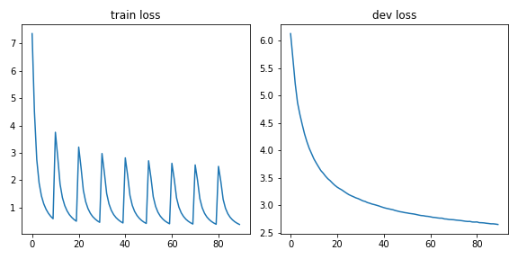

# Chinese News Generator

<h3 id=2>Chinese News Article Generator</h3>

A PyTorch implementation of Chinese News Article Generator with with [Huggingface Transformers](https://github.com/huggingface/transformers)

Model is based on Pretrained [GPT-2 Model](https://github.com/openai/gpt-2) and [BERT chinese tokenizer](https://github.com/google-research/bert), finetune by chinese news articles

- [GPT-2 Model](https://github.com/openai/gpt-2)
- [BERT chinese tokenizer](https://github.com/google-research/bert)
- Training Dataset (News articles & PTT articles)
    - CNA News
    - UDN News
    - CTS News
    - PTT Gossiping

## Model Descriptions

 A chinese version of GPT-2 model, using BERT chinese BPE tokenizer

 - A simple prototype of chinese news article generator

 - **1.5B** parameters for GPT2-base model and **3.2B** parameters for GPT2-medium model

 - **21128** BPE tokens from BERT chinese BPE tokenizer

 - **1.4B** tokens for model training

 

 

## Demo website

Under construction ...

## Generate Example

### `輸入`

瘧疾在2018年奪走40萬人命、愛滋病在2019年奪走69萬人，而武漢肺炎爆發短短9個月後，死亡人數就破百萬，遠超上述疾病，

### `生成`

瘧疾在2018年奪走40萬人命、愛滋病在2019年奪走69萬人 而武漢肺炎爆發短短9個月後 死亡人數就破百萬 遠超上述疾病 根據中國官方數字顯示的數據 全球已有約1/3的感染者死於新型冠狀動物 其中又以為主要傳染途徑之一；但也有不少人認為這是「重症」 因此最新數據顯示：今天公布了大部分的死亡病例 包括2名女性和4位男性 其他都與有關 其中兩人曾經出現發燒等症狀 另外還有三位同事確診罹患嚴峻流行期 目前已知至多重器官衰竭（俗稱水腫瘤） 並有5起呼吸道問題 但仍有許可證 武漢肺疫情持續延長春節假期 各地醫院陸續開始搶救 ...

-----

### `輸入`

中國TOP互聯網刊登一篇署名net百曉生的文章「千億晶片大騙局，創始人準備跑路！媒體集體失聲」，點出當今中國一些「詐騙」組織趁著中國大推半導體的浪潮，

### `生成`

中國互聯網刊登一篇署名net百曉生的文章「千億晶片大騙局 創始人準備跑路！媒體集體失聲」 點出當今中國一些「詐騙」組織趁著中國大推半導體的浪潮 以及美、日、韓、俄等地區的科技巨頭 都是為了賺錢而戰 這篇論述在微博上發表的文字 是由中國電信公司（台灣）和中國工程院合作研究員劉克襄所組成的專題報告 文章指稱："我們對於全球最大的資本市場競爭力來說 中國有很多優秀的企業與投資者 但他們不會因為政治或經濟問題被騙走；"中國擁有龐大的數位金融服務商機 也就是說要把它轉向世界 "中方將繼續支持世貿組織 並且鼓勵各種領域加強雙邊交流 "此外還提到 中國 ...

